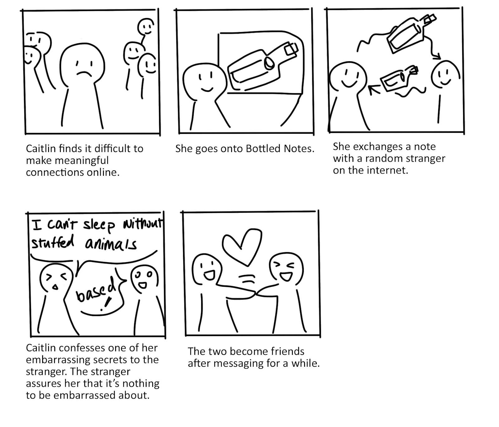
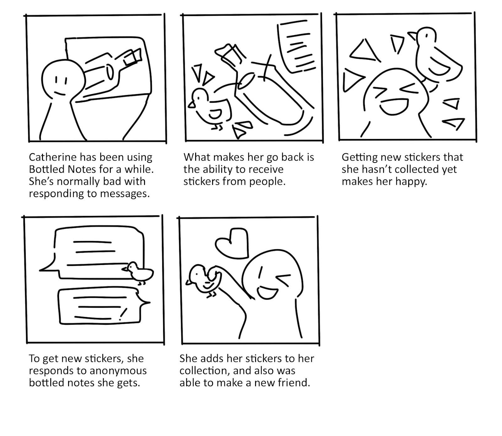
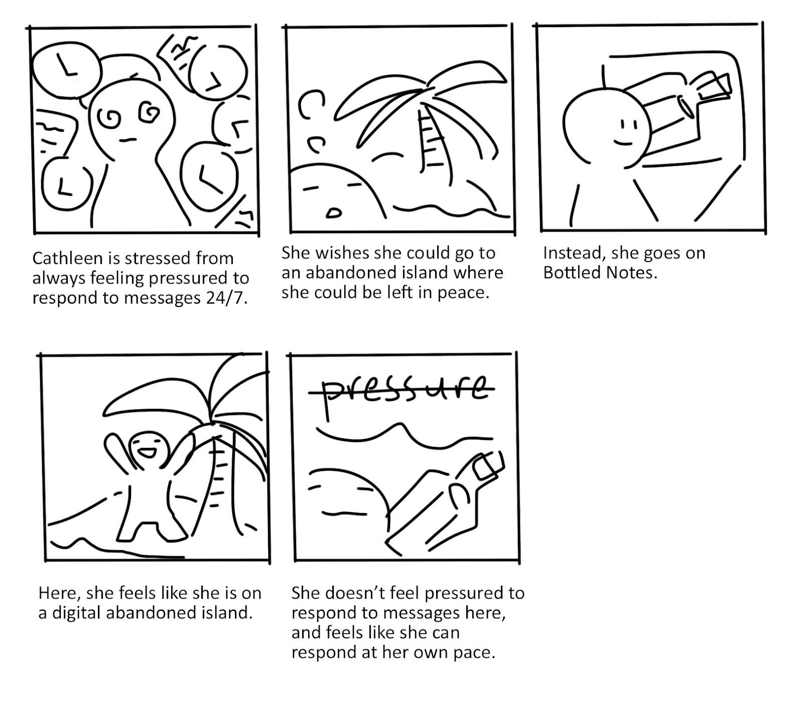
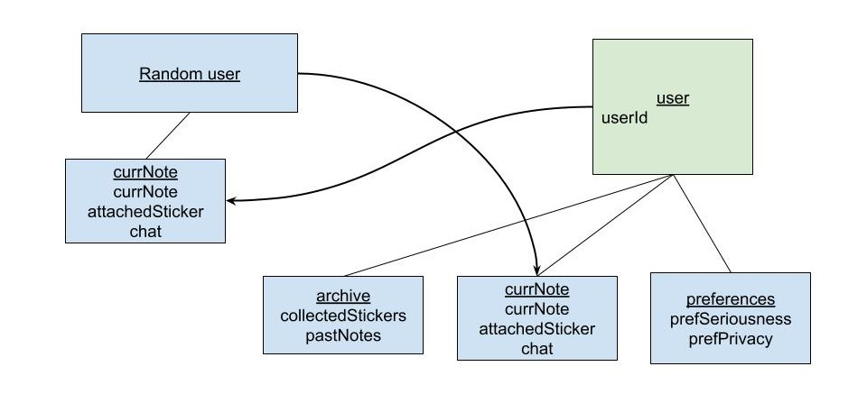
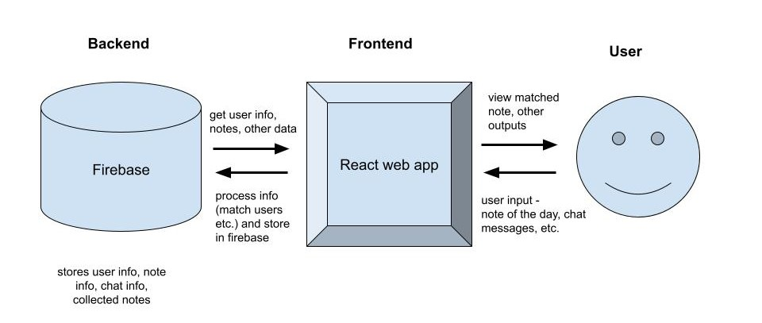

# G4: Requirements
## Functional Requirements
### Primary:
```
User can answer a question of the day.
User can receive someone else's answer to the question of the day.
User can message someone.
```

### Secondary:
```
User can attach stickers to their message in a bottle. 
User can receive stickers from other users' messages in bottles.
User can view their collected stickers.
User can set their response to the question of the day to be private/public.
User can pick the level of seriousness for the question they want to answer. 
User can view their past answers to previous questions of the day. 
```

## Technical Requirements
### Primary:
```
Application generates a new random question of the day every day.
Application matches users randomly and connect them.
```

### Secondary:
```
Application saves a user's collected stickers.
Application allows for a user to send and receive stickers. 
Application saves previous questions of the day.
Application saves a user's past answers to previous questions of the day. 
```

## Usability Requirements
### Primary:
```
Design doesn't pressure the user into always being on it.
Design has intuitive flow.
Design has a gamified view and imagery to create a journaling-like, calming experience.
```

### Secondary:
```
Design is accessible to people who are low vision or blind.
```

# Storyboard

This storyboard shows the main flow of interaction, where a person goes onto the app to meet new people.


This storyboard shows one reason why someone might respond to a note they receive on the app. Other than the purpose of making friends, someone might want to collect stickers on the app.


This storyboard shows another reason why someone might like using the app. Bottled Notes acts as a digital abandoned island where someone who wants to be social but doesn't want to feel pressured to respond to messages all the time can go.


# Architectural design

This is the basic outline for how the system will store user information, and what information two users can see between each other. A user, associated with a userId, will have an archive, currnote, and preferences associated with them. When a user gets matched with a random user, they will be able to view the information under the currNote which consists of the note itself, the attached sticker, and chat messages. 


This is a flow of how the different components of the app will talk to each other. The Firebase will store the user info, note info, chat info, and past notes. The frontend will match users randomly and send that information to the Firebase, which will then retrieve the corresponding info for it. The user will be able to input their answer to the note of the day and chat messages. They will be able to view the anonymous random user's note and received chat messages.

# Explanation
Like seen in the storyboards, a user can get matched with random strangers and receive notes and stickers from them. This architectural design is set up to allow for random matching of users anonymously without compromising extra information. A user is associated with their archive, current note, and preferences. The current note is the only "public" part of a user which can be viewed by another random, anonymous user. The current note consists of the note itself, the attached sticker, and chat messages if the two users choose to engage in the chat. 
