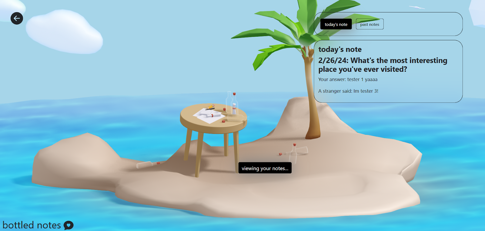

# G6: User Testing

## A- Description of your medium-fidelity prototype

### The functionalities implemented
Here are the primary functionalities I implemented:

* User can answer a random question of the day
* User can receive a random user’s answer to the question of the day
* The application generates a new random question of the day every day
* The application matches users randomly and connects them

I also worked on the styling so the design has a gamified view and a (hopefully) intuitive flow, although there may be bugs.

### GitHub repo and the code

This is [the GitHub repo](https://github.com/UWSocialComputing/bottled-notes-code). The following are general ideas of where the code for the functionalities are located in the repository, and their purposes.

#### User can answer a random question of the day

* **src/api.js 78-81**: addNote submits a user's note into the database.
* **src/right-panel.js 21**: addNote is called when a user clicks the submit button to drop their metaphorical bottled note into the ocean.

#### User can receive a random user’s answer to the question of the day

* **src/api.js 83-92**: getAnswer takes a userId and uses it to search for a certain user's answer of the day if the user has answered the question.
* **src/rightbar-tabs/todays-note.js 16-29**: Gets the random match's ID and response, then displays it. This might get hoisted up to src/right-panel or even src/home.js in the future because I want a way for users to easily see if they got matched with a stranger after looking at the home page.

#### The application generates a new random question of the day every day

* **src/api.js 63-76**: getQotd takes in the question ID for today and retrieves the random question associated with it.

Currently, the client generates the question ID and retrieves the question from the database. This might be better as a server-side function so the question ID doesn't have to be generated by the client. One thing to note is I was initially going to use OpenAI to generate a random question every day, but after playing with it, I got worried that it would generate a lot of duplicates because each question generation will be a new instance. Instead, I had it generate a list of 180 questions, so the app will run out of questions after about half a year.

#### The application matches users randomly and connects them

* **src/api.js 83-92**: getAnswer takes a userId and uses it to search for a certain user's answer of the day if the user has answered the question.
* **functions/index.js 30-64**: pairUsers is a function that runs every 4 hours (this can be changed) automatically. How the random pairing works is that every day, for every user, a random integer between 1-1000 is generated. All of the users who answer the question of the day within those 4 hours get pooled together and matched up by users who have the closest integers. If there is an odd number of users, the odd user doesn't get a match and gets matched in the next instance the pairUsers is called.
    * **functions/index.js 5-28**: resetAnswerToday is a function that runs at midnight every day. This resets every user's answer and regenerates the random integer of the day.
    * **not yet implemented**: upon sign up, a user should have a random integer generated to be associated with their account for the day.

The random matching timing can be changed in the future depending on how many people use the app. I set it at an initial 4 hours because I feel like that would be enough time to get enough responses to pair people up with. 

### The functionalities not implemented

I wanted to get the chat between users to work, but it currently doesn't work. For the user testing, I will omit the chat functionality completely at the start, but ask users if they want to chat with their match after seeing their response to the question. Then, I can choose to wizard-of-oz by acting as a messenger between the people matched. I can also see if the feature warrants being a primary functionality if I learn that the feature is unnecessary, and that people don't want to chat with each other after seeing each other's responses.

The other functionalities are currently completely omitted at this time. However, I am curious about what features a user would find most interesting/useful to them, so I plan to ask them to rank the secondary functionalities I have to see which ones I should prioritize.

* Sticker book to send/receive stickers
* Setting a user's response to be public/private
* Viewing past questions/responses
* Setting the level of seriousness of a question

## B- Screenshot/photo of the prototype:
The prototype can be viewed [deployed on Firebase](https://bottled-notes.web.app/) currently.

Login (styling will be updated in the future): A user can log into the app with a username and password. I will implement a sign up page in the future.

Main page: A user can click on "write a note" to see the question of the day and answer it, or "view notes" to view their response to the question of the day (if it exists), and a random stranger's response to the question of the day (if they get matched).

Writing a note: A user can see the current question of the day, then click the "prepare your bottle" tab to drop it into the ocean. The second tab currently has nothing in it, but it will serve as a place for some potential secondary features like the sticker book/changing privacy/changing seriousness of questions.

Viewing notes: The user can view their response to the question of the day, as well as a stranger's response to the question of the day (if they got matched). The second tab to view past notes currently isn't implemented.

## C- Findings from the user testing sessions

### What was learned

The main thing I learned was that the app isn't as intuitive as I hoped it would be. As someone who has spent a lot of time with the idea, I had a solid understanding of how I wanted a user to interact with the app, but for someone who is looking at the app for the same time, it's unintuitive and needs more explanation. I want to add more explanations and clarifications about what each of the interactions of my app are, and what the purpose of the app is for first-time-users. I'm also considering moving elements around so that people would be more likely to interact with the app, such as through moving the question of the day to the home page so a user doesn't have to click to view it. 

### Going ahead with the current functionality

I think the findings were promising enough to go ahead with the current functionality. One thing I was worried about was how the randomization works. I currently have the random matching function to take all the users who submit an answer every 4 hours, and match those people randomly. I think this is a good starting point, and can be changed depending on how many people use the app. 

### Next functionalities

The main things I want to work on are:
* Add the chatting functionality so users can chat with each other after matching.
* Revamp the home page so that instead of having to click "write a note" to see the question of the day, a user can view it immediately when they log in and answer it immediately. 
* Give an overview/explanation for first time users. Overall, improve the experience for first time users by adding more explanations and making it clear what each option means.
* Fix the flow/styling in the "write a note" tab to make it clearer that there are 2 total steps, and a note hasn't been sent until clicking the "drop your bottle into the sea" button.
* Add a notification for when a message has been received, viewable from the home page. I can probably use Bootstrap's [toast](https://react-bootstrap.netlify.app/docs/components/toasts) for this. 

The other, smaller functionalities I want to work on are:

* Add lazy loading for the 3d spline
* Make the state of a public/private bottle clearer
* Update wording to make things clearer

I also need to fix some bugs (which I put under GitHub issues) and work on the styling more. 