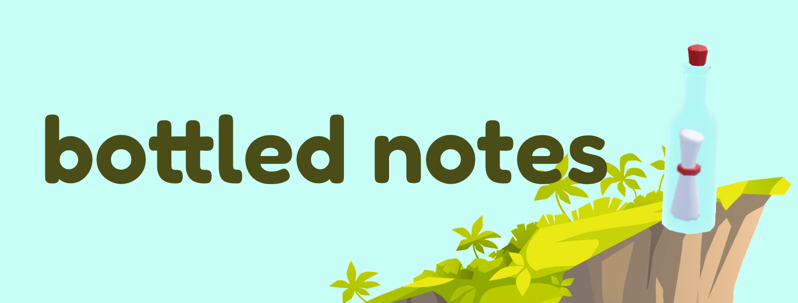
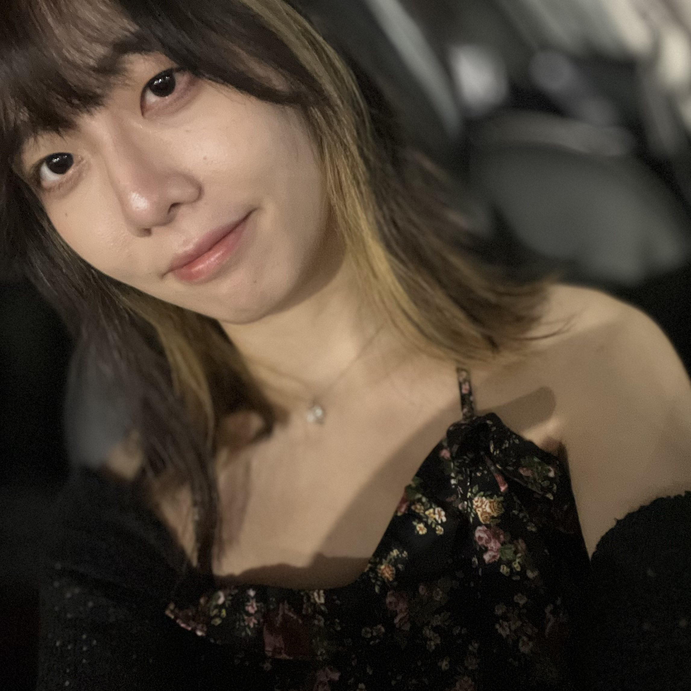

**Bottled notes** is a web app that aims to help create more authentic relationships between people online. [Try it here!](https://bottled-notes.web.app/)

One of the reasons why people find it hard to create authentic relationships online is that you can never really be sure that someone's telling the truth about who they are on the internet. 

Bottled notes has been designed to be based around anonymity. You don't have to trust that someone's telling the truth about who they are because interactions on the app are based around genuine conversations. There are no usernames, profile pictures, or avatars. The main connection is through people's words rather than their profiles. 

Once you log in, you'll be prompted with a question of the day. Write an answer to the question, and send your answer out into the digital ocean. Check back in a few hours. Your bottle will reach a random, anonymous stranger who also answered the question. You can then chat with the person if you want to!

[View the video demo for this project here.](https://youtu.be/_Ws0LMZY1R8?si=gdBzUOnoiu-ujW7h)

This project was created with mostly ReactJS and HTML/CSS. It uses Firebase Hosting, Authentication, and Firestore. The random matching functions are created with Google Cloud functions. The 3D scene was created with Spline. [View the code for this project here.](https://github.com/UWSocialComputing/bottled-notes-code)

This project was created by [Ashley Mochizuki](https://www.linkedin.com/in/ashleymochizuki/) for CSE481P at the University of Washington.

<iframe style="border: 1px solid rgba(0, 0, 0, 0.1);" width="800" height="450" src="https://www.figma.com/embed?embed_host=share&url=https%3A%2F%2Fwww.figma.com%2Ffile%2FhTTc2cVCngpvk736yZaNzM%2Fbottled-notes%3Ftype%3Ddesign%26node-id%3D0%3A1%26mode%3Ddesign%26t%3D6pL2nGb3JnCdWFWf-1" allowfullscreen></iframe>

